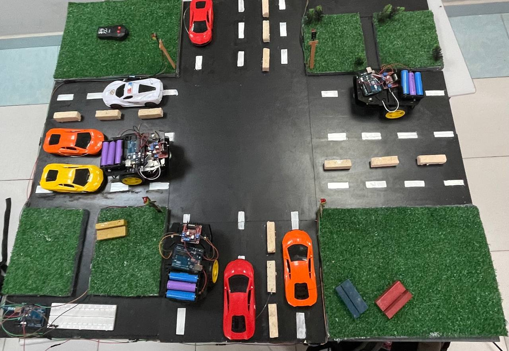
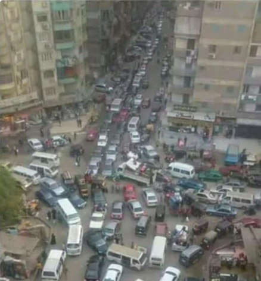
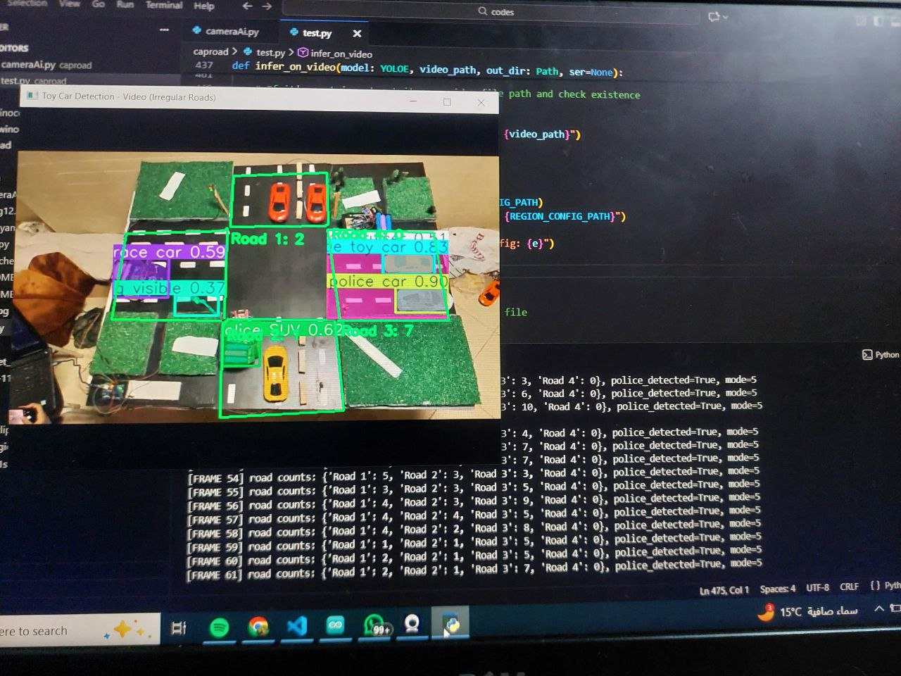
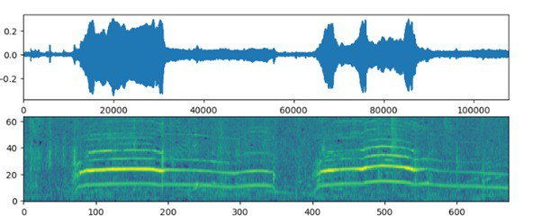
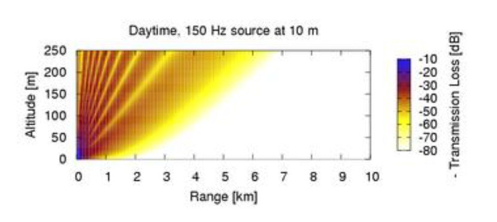
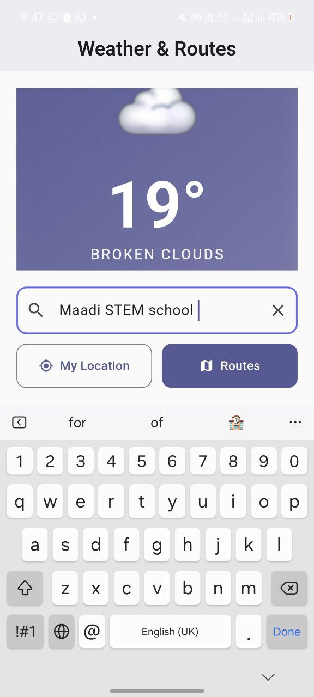
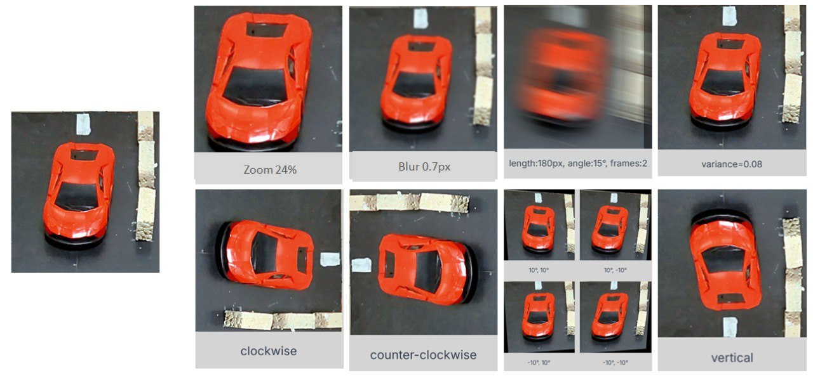
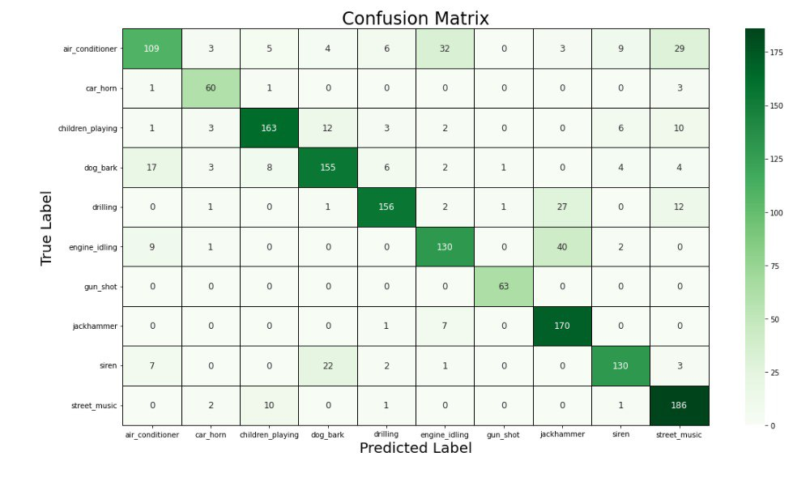

# 🚦 AiTi Street  
## AI-Based Smart Traffic Management & Pollution Reduction System

---

## 📌 Project Overview
AiTi Street is an integrated smart traffic management system designed to address **traffic congestion, emergency response delays, and air pollution** in urban areas.  
The prototype simulates **20th Street in Boulaq Al-Dakror, Cairo**, representing real traffic conditions in Egypt.

The system integrates **Artificial Intelligence, IoT, material science, and mobile applications** to create a sustainable, adaptive, and efficient traffic solution.

### 🖼️ Project Overview Images

---

## 🎯 Problem Statement
Traffic congestion in Egypt leads to:
- Increased travel and waiting times  
- Delayed emergency vehicle response  
- Increased accident rates  
- High NOx and air pollution levels  

Conventional traffic systems rely on fixed-time signals and cannot adapt to real-time congestion or emergencies.  
AiTi Street introduces an **AI-driven adaptive system** that dynamically responds to traffic conditions.

### 🖼️ Problem Context Images

---

## 🧠 System Architecture
The system consists of synchronized modules:
- AI-based vehicle and sound detection  
- Arduino-controlled traffic lights  
- Emergency vehicle prioritization  
- Pollution-reducing road materials  
- A mobile application for drivers  

All modules operate together to optimize traffic flow and safety.

### 🖼️ System Architecture Diagram

---

## 🚗 Traffic Detection Using AI (YOLOE-11S)
The system uses the **YOLOE-11S AI model** to detect:
- Normal vehicles  
- Emergency vehicles  

The model processes real-time camera input to:
- Measure congestion levels  
- Control traffic light timing  
- Trigger emergency vehicle priority  

YOLOE-11S was selected for its **high accuracy, low latency, and robustness**.

### 🖼️ YOLO Detection Images

---

## 🚨 Emergency Vehicle Prioritization (Green Corridor)
When an emergency vehicle is detected:
- All traffic lights turn red  
- A green corridor opens in the emergency vehicle’s direction  
- Normal traffic resumes after passage  

This significantly reduces emergency response time.

---

## 🔊 Siren Detection Using YAMNet
To enhance night-time performance, **YAMNet** sound classification is integrated.
- Detects emergency sirens from up to 1–1.5 km  
- Works alongside the vision model  
- Improves detection reliability in low visibility  

### 🖼️ Siren Detection Images

---

## 🛣️ Photocatalytic Road Material (N-doped TiO₂)
To reduce pollution, **N-doped TiO₂** was incorporated into cement slabs.
- Absorbs NOx pollutants under light  
- Achieved up to **79% pollution reduction**  

This allows roads to actively reduce air pollution.

### 🖼️ Material Preparation & Testing
.jpg)

---

## 📱 Mobile Application (Flutter)
A Flutter-based application was developed to:
- Recommend shortest routes  
- Display real-time weather conditions  
- Reduce accidents caused by sudden weather changes  

### 🖼️ Mobile App Interface

  
  

  <em>Left: Shortest route recommendation &nbsp;&nbsp;|&nbsp;&nbsp; Right: Real-time weather conditions</em>

---

## 🧪 Dataset & Training Process
- Original dataset: 2,878 images  
- After augmentation: 6,926 images  

Augmentation techniques:
- Motion blur  
- Zoom  
- Shear  
- Multi-frame exposure  

Dataset split:
- Training: 6,072  
- Validation: 571  
- Testing: 283  

### 🖼️ Dataset & Augmentation Images

---

## 📊 Results & Performance
| Metric | Value |
|------|------|
| AI Accuracy | 98.7% |
| Response Time | 2.26 seconds |
| Trip Time Reduction | 34.45% |
| NO Reduction | 79% |

### 🖼️ Results Visualization

---

## 🚀 Future Improvements
- Use Vision Transformers (ViT) for large-scale deployment  
- Upgrade microphones for better siren detection  
- Increase nitrogen doping efficiency  
- Expand to city-wide implementation  

